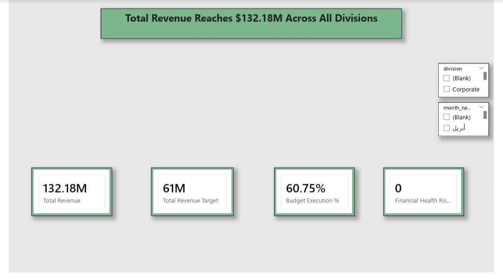
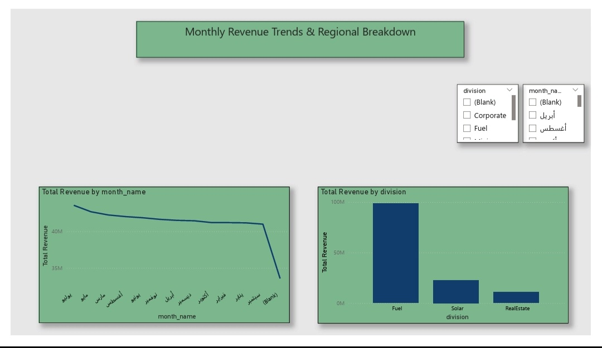
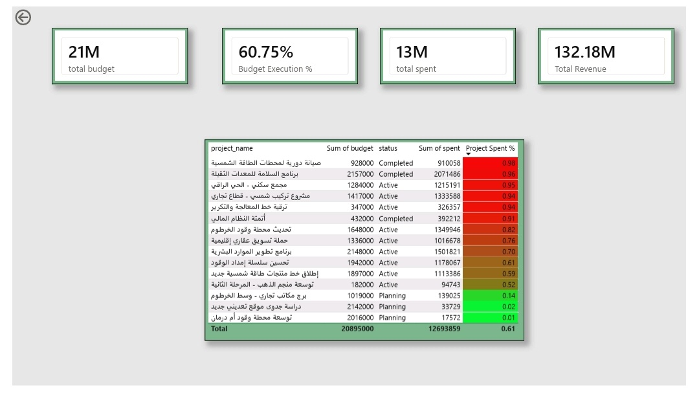
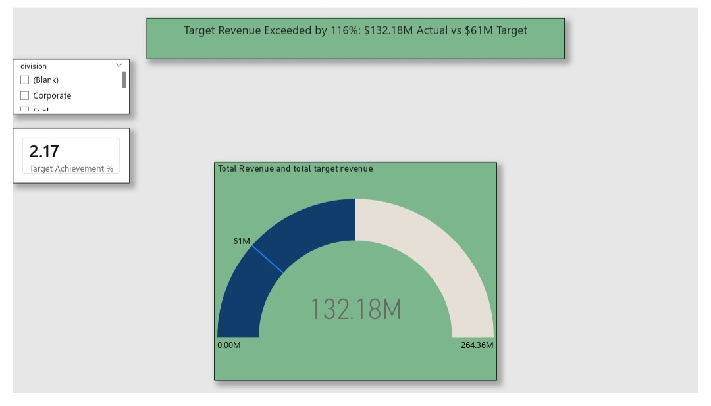

#  PowerNile Operational & Financial Performance Analysis

---

## 1. Problem Statement

PowerNile operates across four distinct business divisions (Fuel, Solar, Real Estate, and Logistics/Projects). The lack of a centralized data consolidation framework made it challenging for executive management to track total revenues against targets, evaluate divisional risk exposures, and monitor overall profitability in real time.

---

## 2. Executive Summary & Context

PowerNile's multi-sector operations generate complex data across financial sales, workforce assignments, and monthly operational targets. This project provides a complete end-to-end data analytics solution designed to combine, analyze, and visualize data across all divisions. The goal is to provide decision-makers with high-level KPI visibility alongside granular department-level drill-through capabilities.

---

## 3. Methodology

The analytics workflow was executed across three core phases:

1. **Excel Data Cleaning & Preprocessing:** Standardized raw datasets, built summary Pivot Tables, and structured dynamic lookup formulas (`XLOOKUP`, `SUMIFS`).
2. **SQL Data Extraction & Transformation:** Created relational tables, joined transaction records with dimension tables, and calculated aggregated monthly metrics and division totals.
3. **Power BI Dashboard Development:** Implemented a star-schema data model, created custom DAX measures (`Total Revenue`, `Total Target Revenue`, `Target Variance %`), and designed an interactive 3-page dashboard.

---

## 4. Key Insights & Findings

* **Target Achievement:** PowerNile generated **$132.18M** in total revenue against a target of **$61M**, exceeding overall monthly targets by **116.7%**.
* **Sector Performance:** Solar Energy and Fuel divisions drove the highest gross revenue share, significantly exceeding forecasted sales targets.
* **Risk & Variance Exposure:** Departmental drill-through analysis highlighted key operational variances in project spending, allowing management to flag high-risk budget overruns early.

---

## 5. Dashboard Architecture & Screenshots

The Power BI report consists of three main analytical pages along with deep-dive visual trends:

* **Page 1: Executive Overview** – High-level metrics, total target variance, division slicers, and regional distribution.
  
  

* **Monthly Revenue Trends & Breakdown** – Detailed visual breakdown of monthly revenue trajectories and division comparisons.
  
  

* **Page 2: Department Details** – Drill-through analysis across project teams with conditional formatting to identify financial risk zones.
  
  

* **Page 3: Performance vs Target** – Executive summary view using Combo visualizations evaluating overall divisional performance against planned targets.
  
  
---

## 6. Business Recommendations

1. **Capital Reallocation:** Reinvest surplus margins from high-performing divisions (Solar/Fuel) into accelerating Real Estate development pipeline execution.
2. **Target Calibration:** Recalibrate monthly financial targets (`monthly_targets`) for upcoming quarters using realistic baseline forecasts reflecting actual market capacity ($130M+ scale).
3. **Budgetary Controls:** Implement automated DAX threshold alerts on project spending (`spent`) to flag budget overruns before expenditure exceeds safe thresholds.

